# 🏥 HIPAA-Compliant Hub-and-Spoke Landing Zone on Azure

**Status:** ✅ Complete — deployed, validated, and torn down

## 🎬 Video Walkthrough

> 🎥 **Loom walkthrough:** _link coming soon_

## 📖 Project Overview

Healthcare organisations handling electronic Protected Health Information (ePHI) must implement specific technical safeguards under HIPAA §164.312: audit controls, access control, integrity controls, and transmission security. The hub-and-spoke topology is the standard way to meet those requirements at scale. Instead of configuring security controls separately on every workload, the hub provides shared services (firewall inspection, centralised logging, secret management, admin access) that each spoke inherits automatically.

This project builds the **network foundation of a landing zone** for a healthcare workload, fully in Terraform:

- A **hub VNet** with Azure Firewall, Azure Bastion, a centralised Log Analytics workspace, Key Vault, and an audit-log storage account.
- **Spoke 1 (clinical ePHI)** and **Spoke 2 (de-identified analytics)**, each in its own VNet and resource group, peered to the hub but never to each other.
- **Forced egress:** user-defined routes send all spoke traffic (`0.0.0.0/0`) through the firewall, so nothing leaves a spoke or crosses between spokes without inspection.
- **Two independent layers of cross-spoke blocking:** NSG deny rules on each spoke subnet *and* named deny rules in the firewall policy.
- **Audit trail:** firewall logs to Log Analytics, plus VNet flow logs on all three VNets with 90-day retention and Traffic Analytics.
- **Continuous compliance assessment:** Microsoft Defender for Cloud plus the built-in HITRUST/HIPAA Azure Policy initiative.

### HIPAA §164.312 mapping — what this build actually deploys

| Safeguard | Controls deployed |
|---|---|
| Access Control — §164.312(a)(1) | Azure RBAC on Key Vault; Bastion for admin access, with no public IPs on spoke resources |
| Audit Controls — §164.312(b) | Central Log Analytics workspace (90-day retention); firewall diagnostic logs; VNet flow logs on hub and both spokes |
| Integrity — §164.312(c)(1) | Key Vault soft delete + purge protection; 90-day blob soft delete on the audit storage account |
| Transmission Security — §164.312(e)(1) | TLS 1.2 minimum + HTTPS-only on storage; Key Vault network ACLs default to Deny |
| Network Segmentation (addressable) | Hub-and-spoke topology, NSGs on every spoke subnet, UDR-forced firewall inspection, no spoke-to-spoke peering |
| Threat Detection (addressable) | Defender for Cloud (Servers, Storage, Key Vault) + HITRUST/HIPAA policy initiative |

**Not included in this build:** workloads (VMs, SQL, analytics services), private endpoints, customer-managed keys, and immutable storage policies. This is the network and governance foundation those would land on. A real HIPAA environment also needs BAAs, policies, and physical and organisational safeguards that sit outside infrastructure code.

### Skills Demonstrated

- Hub-and-spoke network design with non-transitive peering and forced tunnelling via UDRs
- Azure Firewall with Firewall Policy (application and network rule collections)
- Defence in depth: NSG and firewall layers enforcing the same isolation independently
- Centralised audit logging (Log Analytics, diagnostic settings, VNet flow logs, Traffic Analytics)
- Key Vault hardening (RBAC model, soft delete, purge protection, network ACLs)
- Governance at subscription scope: Defender for Cloud plans and regulatory policy initiatives
- Mapping regulatory requirements (HIPAA §164.312) to concrete Azure controls
- Terraform: multi-resource-group deployments, data sources for platform-managed resources, `time_sleep` for Azure's asynchronous side effects

## 🏗️ Architecture Diagram

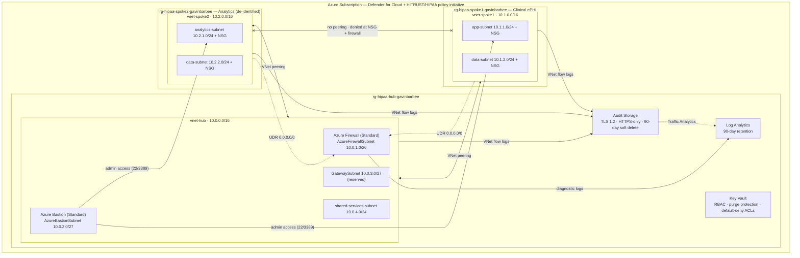

## ✅ Prerequisites

| Requirement | How to verify (PowerShell) |
|---|---|
| Azure CLI installed and authenticated | `az account show` |
| Terraform v1.5+ | `terraform -version` |
| Active Azure subscription | `az account list --output table` |
| Owner, or Contributor + User Access Administrator, on the subscription (Defender plans and the policy assignment are subscription-scoped) | `az role assignment list --assignee $(az account show --query user.name -o tsv) --output table` |

> 💰 **Cost warning:** Azure Firewall Standard is the main cost driver (about $1.25/hour), with Bastion Standard on top. I destroy the environment whenever I'm not actively using it. The whole stack redeploys with `terraform apply`.

## 🏷️ Naming Conventions

| Resource | Name |
|---|---|
| Hub resource group | `rg-hipaa-hub-gavinbarbee` |
| Spoke 1 resource group | `rg-hipaa-spoke1-gavinbarbee` |
| Spoke 2 resource group | `rg-hipaa-spoke2-gavinbarbee` |
| Hub VNet | `vnet-hub-gavinbarbee` |
| Spoke VNets | `vnet-spoke1-gavinbarbee`, `vnet-spoke2-gavinbarbee` |
| Azure Firewall / Public IP | `fw-hipaa-gavinbarbee` / `pip-firewall-gavinbarbee` |
| Firewall Policy / Rule Collection Group | `fwpol-hipaa-gavinbarbee` / `rcg-hipaa` |
| Azure Bastion / Public IP | `bastion-hipaa-gavinbarbee` / `pip-bastion-gavinbarbee` |
| Key Vault | `kv-hipaa-gavinbarbee` |
| Log Analytics Workspace | `law-hipaa-gavinbarbee` |
| Audit Storage Account | `sthipaaauditgavinbarbee` |
| NSGs | `nsg-spoke1-app-gavinbarbee`, `nsg-spoke1-data-gavinbarbee`, `nsg-spoke2-app-gavinbarbee`, `nsg-spoke2-data-gavinbarbee` |
| Route Tables | `rt-spoke1-gavinbarbee`, `rt-spoke2-gavinbarbee` |
| VNet Flow Logs | `flowlog-vnet-hub`, `flowlog-vnet-spoke1`, `flowlog-vnet-spoke2` |
| Network Watcher (Azure-managed) | `NetworkWatcher_eastus2` in `NetworkWatcherRG` |
| Policy Assignment | `hipaa-hitech` (HITRUST/HIPAA initiative) |

## 🪜 Project Steps

### Step 1 — Create the project structure

Run each line separately in PowerShell:

```powershell
New-Item -ItemType Directory -Force -Path "$HOME\OneDrive\Desktop\azure-hipaa-hub-spoke-landing-zone" | Out-Null
```
```powershell
cd "$HOME\OneDrive\Desktop\azure-hipaa-hub-spoke-landing-zone"
```
```powershell
New-Item -ItemType File main.tf, variables.tf, outputs.tf, terraform.tfvars, terraform.tfvars.example
```
```powershell
@("terraform.tfvars","*.tfstate","*.tfstate.backup",".terraform/",".terraform.lock.hcl","*.tfplan","CLAUDE.md",".claude/") | Set-Content .gitignore
```

### Step 2 — Write `variables.tf`

```hcl
variable "subscription_id" {
  description = "Azure subscription ID. Required by azurerm 4.x; kept in terraform.tfvars (gitignored)."
  type        = string
}

variable "yourname" {
  description = "Your name suffix for all resource names. Lowercase, no spaces."
  type        = string
}

variable "location" {
  description = "Azure region for all resources."
  type        = string
  default     = "eastus2"
}

variable "tags" {
  description = "Tags applied to all resources."
  type        = map(string)
  default = {
    project     = "hipaa-hub-spoke"
    environment = "lab"
    managed_by  = "terraform"
    compliance  = "hipaa"
  }
}

# Hub address space
variable "hub_address_space" {
  type    = string
  default = "10.0.0.0/16"
}

variable "hub_firewall_subnet" {
  type    = string
  default = "10.0.1.0/26"
}

variable "hub_bastion_subnet" {
  type    = string
  default = "10.0.2.0/27"
}

variable "hub_gateway_subnet" {
  type    = string
  default = "10.0.3.0/27"
}

variable "hub_shared_subnet" {
  type    = string
  default = "10.0.4.0/24"
}

# Spoke 1 address space — clinical ePHI
variable "spoke1_address_space" {
  type    = string
  default = "10.1.0.0/16"
}

variable "spoke1_app_subnet" {
  type    = string
  default = "10.1.1.0/24"
}

variable "spoke1_data_subnet" {
  type    = string
  default = "10.1.2.0/24"
}

# Spoke 2 address space — analytics
variable "spoke2_address_space" {
  type    = string
  default = "10.2.0.0/16"
}

variable "spoke2_app_subnet" {
  type    = string
  default = "10.2.1.0/24"
}

variable "spoke2_data_subnet" {
  type    = string
  default = "10.2.2.0/24"
}
```

### Step 3 — Write `terraform.tfvars`

`terraform.tfvars` is gitignored. The repo includes `terraform.tfvars.example` instead:

```hcl
yourname        = "<your-lowercase-name>"
location        = "eastus2"
subscription_id = "<your-subscription-id>"
```

Copy it to `terraform.tfvars`, set `yourname` to your own lowercase name, and set `subscription_id` to the output of `az account show --query id -o tsv`. It must keep `kv-hipaa-<name>` within Key Vault's 24-character limit and `sthipaaaudit<name>` within storage's 24-character, lowercase-alphanumeric limit.

### Step 4 — Write `main.tf`

The file is shown below section by section; together the blocks make up the complete `main.tf`.

#### Provider

The `azurerm` provider pinned to 4.x (4.x is the first major version that supports VNet flow logs via `target_resource_id`; it also requires `subscription_id` explicitly, which I pass in from `terraform.tfvars`), plus the `time` provider (used for the Network Watcher wait further down). The Key Vault feature flags let Terraform recover a soft-deleted vault with the same name on redeploy.

```hcl
terraform {
  required_providers {
    azurerm = {
      source  = "hashicorp/azurerm"
      version = "~> 4.0"
    }
    time = {
      source  = "hashicorp/time"
      version = "~> 0.9"
    }
  }
}

provider "azurerm" {
  subscription_id = var.subscription_id

  features {
    key_vault {
      purge_soft_delete_on_destroy    = true
      recover_soft_deleted_key_vaults = true
    }
  }
}

data "azurerm_client_config" "current" {}
```

#### Resource Groups

Three resource groups: shared services in the hub, clinical ePHI in Spoke 1, de-identified analytics in Spoke 2. Separate resource groups give each tier its own RBAC and lifecycle boundary.

```hcl
# ── Resource Groups ──────────────────────────────────────────────────
resource "azurerm_resource_group" "hub" {
  name     = "rg-hipaa-hub-${var.yourname}"
  location = var.location
  tags     = var.tags
}

resource "azurerm_resource_group" "spoke1" {
  name     = "rg-hipaa-spoke1-${var.yourname}"
  location = var.location
  tags     = var.tags
}

resource "azurerm_resource_group" "spoke2" {
  name     = "rg-hipaa-spoke2-${var.yourname}"
  location = var.location
  tags     = var.tags
}
```

#### Log Analytics Workspace — Centralised Audit Logging

One workspace for the whole environment, with 90-day retention to support HIPAA §164.312(b) audit controls.

```hcl
# ── Log Analytics Workspace ───────────────────────────────────────────
# HIPAA requires audit logs be retained and protected.
# 90 days is the minimum recommended; production should be 365+.
resource "azurerm_log_analytics_workspace" "hub" {
  name                = "law-hipaa-${var.yourname}"
  location            = azurerm_resource_group.hub.location
  resource_group_name = azurerm_resource_group.hub.name
  sku                 = "PerGB2018"
  retention_in_days   = 90
  tags                = var.tags
}
```

#### Storage Account — Audit Log Archive

Holds raw VNet flow logs. TLS 1.2 minimum and HTTPS-only enforce transmission security; 90-day blob soft delete protects the audit trail from accidental or malicious deletion.

```hcl
# ── Storage Account for audit log archive ────────────────────────────
resource "azurerm_storage_account" "audit" {
  name                       = "sthipaaaudit${var.yourname}"
  resource_group_name        = azurerm_resource_group.hub.name
  location                   = azurerm_resource_group.hub.location
  account_tier               = "Standard"
  account_replication_type   = "LRS"
  min_tls_version            = "TLS1_2"
  https_traffic_only_enabled = true

  # Soft delete — prevents accidental or malicious deletion of audit logs
  blob_properties {
    delete_retention_policy {
      days = 90
    }
  }

  tags = var.tags
}
```

#### Key Vault — Secret and Key Management

RBAC authorization, 90-day soft delete, and purge protection so keys can't be permanently destroyed early. Network ACLs default to Deny, with only trusted Azure services bypassing. My own account gets Key Vault Administrator.

```hcl
# ── Key Vault ─────────────────────────────────────────────────────────
resource "azurerm_key_vault" "hub" {
  name                       = "kv-hipaa-${var.yourname}"
  location                   = azurerm_resource_group.hub.location
  resource_group_name        = azurerm_resource_group.hub.name
  tenant_id                  = data.azurerm_client_config.current.tenant_id
  sku_name                   = "standard"
  enable_rbac_authorization  = true
  soft_delete_retention_days = 90
  purge_protection_enabled   = true

  # Deny all public network access — HIPAA transmission security
  network_acls {
    default_action = "Deny"
    bypass         = "AzureServices"
  }

  tags = var.tags
}

# Grant your account Key Vault Administrator
resource "azurerm_role_assignment" "kv_admin" {
  scope                = azurerm_key_vault.hub.id
  role_definition_name = "Key Vault Administrator"
  principal_id         = data.azurerm_client_config.current.object_id
}
```

#### Hub VNet and Subnets

`AzureFirewallSubnet` and `AzureBastionSubnet` are reserved names Azure requires exactly. `GatewaySubnet` is reserved for a future VPN/ExpressRoute gateway.

```hcl
# ── Hub VNet ──────────────────────────────────────────────────────────
resource "azurerm_virtual_network" "hub" {
  name                = "vnet-hub-${var.yourname}"
  location            = azurerm_resource_group.hub.location
  resource_group_name = azurerm_resource_group.hub.name
  address_space       = [var.hub_address_space]
  tags                = var.tags
}

# AzureFirewallSubnet — name must be exactly this, minimum /26
resource "azurerm_subnet" "hub_firewall" {
  name                 = "AzureFirewallSubnet"
  resource_group_name  = azurerm_resource_group.hub.name
  virtual_network_name = azurerm_virtual_network.hub.name
  address_prefixes     = [var.hub_firewall_subnet]
}

# AzureBastionSubnet — name must be exactly this, minimum /27
resource "azurerm_subnet" "hub_bastion" {
  name                 = "AzureBastionSubnet"
  resource_group_name  = azurerm_resource_group.hub.name
  virtual_network_name = azurerm_virtual_network.hub.name
  address_prefixes     = [var.hub_bastion_subnet]
}

resource "azurerm_subnet" "hub_gateway" {
  name                 = "GatewaySubnet"
  resource_group_name  = azurerm_resource_group.hub.name
  virtual_network_name = azurerm_virtual_network.hub.name
  address_prefixes     = [var.hub_gateway_subnet]
}

resource "azurerm_subnet" "hub_shared" {
  name                 = "shared-services-subnet"
  resource_group_name  = azurerm_resource_group.hub.name
  virtual_network_name = azurerm_virtual_network.hub.name
  address_prefixes     = [var.hub_shared_subnet]
}
```

#### Azure Firewall and Firewall Policy

The inspection point for all spoke egress and cross-spoke traffic. I attach the policy to the firewall explicitly with `firewall_policy_id`: a policy and rule collection group can deploy successfully as standalone objects, but the firewall only enforces them once they're linked. Without that link, cross-spoke traffic would still be dropped by the firewall's implicit default-deny, but not by a named rule I can point to in the logs, and the Azure Monitor/Windows Update allow rules would never apply.

```hcl
# ── Azure Firewall ────────────────────────────────────────────────────
resource "azurerm_public_ip" "firewall" {
  name                = "pip-firewall-${var.yourname}"
  location            = azurerm_resource_group.hub.location
  resource_group_name = azurerm_resource_group.hub.name
  allocation_method   = "Static"
  sku                 = "Standard"
  tags                = var.tags
}

resource "azurerm_firewall" "hub" {
  name                = "fw-hipaa-${var.yourname}"
  location            = azurerm_resource_group.hub.location
  resource_group_name = azurerm_resource_group.hub.name
  sku_name            = "AZFW_VNet"
  sku_tier            = "Standard"

  # Attach the policy — without this, the policy and its rules exist but are never enforced
  firewall_policy_id = azurerm_firewall_policy.hub.id

  tags = var.tags

  ip_configuration {
    name                 = "configuration"
    subnet_id            = azurerm_subnet.hub_firewall.id
    public_ip_address_id = azurerm_public_ip.firewall.id
  }
}

# Firewall diagnostic settings — ship all logs to Log Analytics
resource "azurerm_monitor_diagnostic_setting" "firewall" {
  name                       = "diag-firewall"
  target_resource_id         = azurerm_firewall.hub.id
  log_analytics_workspace_id = azurerm_log_analytics_workspace.hub.id

  enabled_log { category = "AzureFirewallApplicationRule" }
  enabled_log { category = "AzureFirewallNetworkRule" }
  enabled_log { category = "AzureFirewallDnsProxy" }

  metric {
    category = "AllMetrics"
    enabled  = true
  }
}

# Firewall Policy — Application rules allowing HTTPS egress
resource "azurerm_firewall_policy" "hub" {
  name                = "fwpol-hipaa-${var.yourname}"
  resource_group_name = azurerm_resource_group.hub.name
  location            = azurerm_resource_group.hub.location
  sku                 = "Standard"
  tags                = var.tags
}

resource "azurerm_firewall_policy_rule_collection_group" "main" {
  name               = "rcg-hipaa"
  firewall_policy_id = azurerm_firewall_policy.hub.id
  priority           = 100

  # Allow HTTPS egress to Azure services only
  application_rule_collection {
    name     = "allow-azure-services"
    priority = 100
    action   = "Allow"

    rule {
      name              = "allow-azure-monitor"
      source_addresses  = ["10.1.0.0/16", "10.2.0.0/16"]
      destination_fqdns = ["*.ods.opinsights.azure.com", "*.oms.opinsights.azure.com", "*.monitoring.azure.com"]
      protocols {
        type = "Https"
        port = 443
      }
    }

    rule {
      name              = "allow-azure-updates"
      source_addresses  = ["10.1.0.0/16", "10.2.0.0/16"]
      destination_fqdns = ["*.windowsupdate.microsoft.com", "*.update.microsoft.com"]
      protocols {
        type = "Https"
        port = 443
      }
    }
  }

  # Block all other internet traffic — deny by default
  network_rule_collection {
    name     = "deny-spoke-to-spoke"
    priority = 200
    action   = "Deny"

    rule {
      name                  = "deny-spoke1-to-spoke2"
      source_addresses      = ["10.1.0.0/16"]
      destination_addresses = ["10.2.0.0/16"]
      protocols             = ["Any"]
      destination_ports     = ["*"]
    }

    rule {
      name                  = "deny-spoke2-to-spoke1"
      source_addresses      = ["10.2.0.0/16"]
      destination_addresses = ["10.1.0.0/16"]
      protocols             = ["Any"]
      destination_ports     = ["*"]
    }
  }
}
```

#### Azure Bastion

Admin access to spoke VMs without any public IPs on the spokes. Sessions go through an authenticated Azure portal session, with no shared credentials.

```hcl
# ── Azure Bastion ─────────────────────────────────────────────────────
resource "azurerm_public_ip" "bastion" {
  name                = "pip-bastion-${var.yourname}"
  location            = azurerm_resource_group.hub.location
  resource_group_name = azurerm_resource_group.hub.name
  allocation_method   = "Static"
  sku                 = "Standard"
  tags                = var.tags
}

resource "azurerm_bastion_host" "hub" {
  name                = "bastion-hipaa-${var.yourname}"
  location            = azurerm_resource_group.hub.location
  resource_group_name = azurerm_resource_group.hub.name
  sku                 = "Standard"
  tags                = var.tags

  ip_configuration {
    name                 = "configuration"
    subnet_id            = azurerm_subnet.hub_bastion.id
    public_ip_address_id = azurerm_public_ip.bastion.id
  }
}
```

#### Spoke 1 — Clinical ePHI Network

NSGs allow management only from the hub, deny internet inbound, and deny Spoke 2 explicitly. The data subnet accepts only SQL/HTTPS from the app subnet. The route table forces `0.0.0.0/0` to the firewall's private IP.

```hcl
# ── Spoke 1 VNet ──────────────────────────────────────────────────────
resource "azurerm_virtual_network" "spoke1" {
  name                = "vnet-spoke1-${var.yourname}"
  location            = azurerm_resource_group.spoke1.location
  resource_group_name = azurerm_resource_group.spoke1.name
  address_space       = [var.spoke1_address_space]
  tags                = var.tags
}

# NSG — Spoke 1 App Subnet
resource "azurerm_network_security_group" "spoke1_app" {
  name                = "nsg-spoke1-app-${var.yourname}"
  location            = azurerm_resource_group.spoke1.location
  resource_group_name = azurerm_resource_group.spoke1.name
  tags                = var.tags

  # Allow management from hub (Bastion)
  security_rule {
    name                       = "allow-hub-inbound"
    priority                   = 100
    direction                  = "Inbound"
    access                     = "Allow"
    protocol                   = "Tcp"
    source_port_range          = "*"
    destination_port_ranges    = ["22", "3389"]
    source_address_prefix      = var.hub_address_space
    destination_address_prefix = "*"
  }

  # Deny all direct internet inbound
  security_rule {
    name                       = "deny-internet-inbound"
    priority                   = 4000
    direction                  = "Inbound"
    access                     = "Deny"
    protocol                   = "*"
    source_port_range          = "*"
    destination_port_range     = "*"
    source_address_prefix      = "Internet"
    destination_address_prefix = "*"
  }

  # Deny cross-spoke traffic (belt-and-suspenders with firewall rule)
  security_rule {
    name                       = "deny-spoke2-inbound"
    priority                   = 3000
    direction                  = "Inbound"
    access                     = "Deny"
    protocol                   = "*"
    source_port_range          = "*"
    destination_port_range     = "*"
    source_address_prefix      = var.spoke2_address_space
    destination_address_prefix = "*"
  }
}

resource "azurerm_subnet" "spoke1_app" {
  name                 = "app-subnet"
  resource_group_name  = azurerm_resource_group.spoke1.name
  virtual_network_name = azurerm_virtual_network.spoke1.name
  address_prefixes     = [var.spoke1_app_subnet]
}

resource "azurerm_subnet_network_security_group_association" "spoke1_app" {
  subnet_id                 = azurerm_subnet.spoke1_app.id
  network_security_group_id = azurerm_network_security_group.spoke1_app.id
}

resource "azurerm_network_security_group" "spoke1_data" {
  name                = "nsg-spoke1-data-${var.yourname}"
  location            = azurerm_resource_group.spoke1.location
  resource_group_name = azurerm_resource_group.spoke1.name
  tags                = var.tags

  # Only allow inbound from spoke1 app subnet — data tier isolation
  security_rule {
    name                       = "allow-spoke1-app-inbound"
    priority                   = 100
    direction                  = "Inbound"
    access                     = "Allow"
    protocol                   = "Tcp"
    source_port_range          = "*"
    destination_port_ranges    = ["1433", "443"]
    source_address_prefix      = var.spoke1_app_subnet
    destination_address_prefix = "*"
  }

  # Deny everything else — ePHI data tier is maximally locked down
  security_rule {
    name                       = "deny-all-other-inbound"
    priority                   = 4096
    direction                  = "Inbound"
    access                     = "Deny"
    protocol                   = "*"
    source_port_range          = "*"
    destination_port_range     = "*"
    source_address_prefix      = "*"
    destination_address_prefix = "*"
  }
}

resource "azurerm_subnet" "spoke1_data" {
  name                 = "data-subnet"
  resource_group_name  = azurerm_resource_group.spoke1.name
  virtual_network_name = azurerm_virtual_network.spoke1.name
  address_prefixes     = [var.spoke1_data_subnet]
}

resource "azurerm_subnet_network_security_group_association" "spoke1_data" {
  subnet_id                 = azurerm_subnet.spoke1_data.id
  network_security_group_id = azurerm_network_security_group.spoke1_data.id
}

# UDR — force all egress through Azure Firewall
resource "azurerm_route_table" "spoke1" {
  name                          = "rt-spoke1-${var.yourname}"
  location                      = azurerm_resource_group.spoke1.location
  resource_group_name           = azurerm_resource_group.spoke1.name
  bgp_route_propagation_enabled = false
  tags                          = var.tags

  route {
    name                   = "force-internet-via-firewall"
    address_prefix         = "0.0.0.0/0"
    next_hop_type          = "VirtualAppliance"
    next_hop_in_ip_address = azurerm_firewall.hub.ip_configuration[0].private_ip_address
  }
}

resource "azurerm_subnet_route_table_association" "spoke1_app" {
  subnet_id      = azurerm_subnet.spoke1_app.id
  route_table_id = azurerm_route_table.spoke1.id
}

resource "azurerm_subnet_route_table_association" "spoke1_data" {
  subnet_id      = azurerm_subnet.spoke1_data.id
  route_table_id = azurerm_route_table.spoke1.id
}
```

#### Spoke 2 — Analytics Network

Mirrors Spoke 1's NSG and UDR pattern in a completely separate VNet and resource group.

```hcl
# ── Spoke 2 VNet ──────────────────────────────────────────────────────
resource "azurerm_virtual_network" "spoke2" {
  name                = "vnet-spoke2-${var.yourname}"
  location            = azurerm_resource_group.spoke2.location
  resource_group_name = azurerm_resource_group.spoke2.name
  address_space       = [var.spoke2_address_space]
  tags                = var.tags
}

resource "azurerm_network_security_group" "spoke2_app" {
  name                = "nsg-spoke2-app-${var.yourname}"
  location            = azurerm_resource_group.spoke2.location
  resource_group_name = azurerm_resource_group.spoke2.name
  tags                = var.tags

  security_rule {
    name                       = "allow-hub-inbound"
    priority                   = 100
    direction                  = "Inbound"
    access                     = "Allow"
    protocol                   = "Tcp"
    source_port_range          = "*"
    destination_port_ranges    = ["22", "3389"]
    source_address_prefix      = var.hub_address_space
    destination_address_prefix = "*"
  }

  security_rule {
    name                       = "deny-internet-inbound"
    priority                   = 4000
    direction                  = "Inbound"
    access                     = "Deny"
    protocol                   = "*"
    source_port_range          = "*"
    destination_port_range     = "*"
    source_address_prefix      = "Internet"
    destination_address_prefix = "*"
  }

  security_rule {
    name                       = "deny-spoke1-inbound"
    priority                   = 3000
    direction                  = "Inbound"
    access                     = "Deny"
    protocol                   = "*"
    source_port_range          = "*"
    destination_port_range     = "*"
    source_address_prefix      = var.spoke1_address_space
    destination_address_prefix = "*"
  }
}

resource "azurerm_subnet" "spoke2_app" {
  name                 = "analytics-subnet"
  resource_group_name  = azurerm_resource_group.spoke2.name
  virtual_network_name = azurerm_virtual_network.spoke2.name
  address_prefixes     = [var.spoke2_app_subnet]
}

resource "azurerm_subnet_network_security_group_association" "spoke2_app" {
  subnet_id                 = azurerm_subnet.spoke2_app.id
  network_security_group_id = azurerm_network_security_group.spoke2_app.id
}

resource "azurerm_network_security_group" "spoke2_data" {
  name                = "nsg-spoke2-data-${var.yourname}"
  location            = azurerm_resource_group.spoke2.location
  resource_group_name = azurerm_resource_group.spoke2.name
  tags                = var.tags

  security_rule {
    name                       = "allow-spoke2-app-inbound"
    priority                   = 100
    direction                  = "Inbound"
    access                     = "Allow"
    protocol                   = "Tcp"
    source_port_range          = "*"
    destination_port_ranges    = ["1433", "443"]
    source_address_prefix      = var.spoke2_app_subnet
    destination_address_prefix = "*"
  }

  security_rule {
    name                       = "deny-all-other-inbound"
    priority                   = 4096
    direction                  = "Inbound"
    access                     = "Deny"
    protocol                   = "*"
    source_port_range          = "*"
    destination_port_range     = "*"
    source_address_prefix      = "*"
    destination_address_prefix = "*"
  }
}

resource "azurerm_subnet" "spoke2_data" {
  name                 = "data-subnet"
  resource_group_name  = azurerm_resource_group.spoke2.name
  virtual_network_name = azurerm_virtual_network.spoke2.name
  address_prefixes     = [var.spoke2_data_subnet]
}

resource "azurerm_subnet_network_security_group_association" "spoke2_data" {
  subnet_id                 = azurerm_subnet.spoke2_data.id
  network_security_group_id = azurerm_network_security_group.spoke2_data.id
}

# UDR — Spoke 2
resource "azurerm_route_table" "spoke2" {
  name                          = "rt-spoke2-${var.yourname}"
  location                      = azurerm_resource_group.spoke2.location
  resource_group_name           = azurerm_resource_group.spoke2.name
  bgp_route_propagation_enabled = false
  tags                          = var.tags

  route {
    name                   = "force-internet-via-firewall"
    address_prefix         = "0.0.0.0/0"
    next_hop_type          = "VirtualAppliance"
    next_hop_in_ip_address = azurerm_firewall.hub.ip_configuration[0].private_ip_address
  }
}

resource "azurerm_subnet_route_table_association" "spoke2_app" {
  subnet_id      = azurerm_subnet.spoke2_app.id
  route_table_id = azurerm_route_table.spoke2.id
}

resource "azurerm_subnet_route_table_association" "spoke2_data" {
  subnet_id      = azurerm_subnet.spoke2_data.id
  route_table_id = azurerm_route_table.spoke2.id
}
```

#### VNet Peering — Hub to Both Spokes

Each spoke peers with the hub in both directions. The spokes are never peered with each other, and peering is non-transitive, so the only path between spokes is the UDR through the firewall.

```hcl
# ── VNet Peering: Hub ↔ Spoke 1 ──────────────────────────────────────
resource "azurerm_virtual_network_peering" "hub_to_spoke1" {
  name                         = "peer-hub-to-spoke1"
  resource_group_name          = azurerm_resource_group.hub.name
  virtual_network_name         = azurerm_virtual_network.hub.name
  remote_virtual_network_id    = azurerm_virtual_network.spoke1.id
  allow_forwarded_traffic      = true
  allow_gateway_transit        = true
  allow_virtual_network_access = true
}

resource "azurerm_virtual_network_peering" "spoke1_to_hub" {
  name                         = "peer-spoke1-to-hub"
  resource_group_name          = azurerm_resource_group.spoke1.name
  virtual_network_name         = azurerm_virtual_network.spoke1.name
  remote_virtual_network_id    = azurerm_virtual_network.hub.id
  allow_forwarded_traffic      = true
  use_remote_gateways          = false
  allow_virtual_network_access = true
}

# ── VNet Peering: Hub ↔ Spoke 2 ──────────────────────────────────────
resource "azurerm_virtual_network_peering" "hub_to_spoke2" {
  name                         = "peer-hub-to-spoke2"
  resource_group_name          = azurerm_resource_group.hub.name
  virtual_network_name         = azurerm_virtual_network.hub.name
  remote_virtual_network_id    = azurerm_virtual_network.spoke2.id
  allow_forwarded_traffic      = true
  allow_gateway_transit        = true
  allow_virtual_network_access = true
}

resource "azurerm_virtual_network_peering" "spoke2_to_hub" {
  name                         = "peer-spoke2-to-hub"
  resource_group_name          = azurerm_resource_group.spoke2.name
  virtual_network_name         = azurerm_virtual_network.spoke2.name
  remote_virtual_network_id    = azurerm_virtual_network.hub.id
  allow_forwarded_traffic      = true
  use_remote_gateways          = false
  allow_virtual_network_access = true
}
```

#### Defender for Cloud and HITRUST/HIPAA Policy Initiative

Defender plans for servers, storage, and Key Vault, each with its `subplan` pinned explicitly, plus the built-in HITRUST/HIPAA regulatory compliance initiative assigned at subscription scope. Both apply to the **entire subscription**, not just these resource groups.

```hcl
# ── Defender for Cloud ────────────────────────────────────────────────
resource "azurerm_security_center_subscription_pricing" "defender_servers" {
  tier          = "Standard"
  resource_type = "VirtualMachines"
  subplan       = "P2"
}

resource "azurerm_security_center_subscription_pricing" "defender_storage" {
  tier          = "Standard"
  resource_type = "StorageAccounts"
  subplan       = "DefenderForStorageV2"
}

resource "azurerm_security_center_subscription_pricing" "defender_keyvault" {
  tier          = "Standard"
  resource_type = "KeyVaults"
  subplan       = "PerKeyVault"
}

# Assign the HITRUST/HIPAA built-in policy initiative to the subscription
resource "azurerm_subscription_policy_assignment" "hipaa" {
  name                 = "hipaa-hitech"
  display_name         = "HIPAA HITECH"
  policy_definition_id = "/providers/Microsoft.Authorization/policySetDefinitions/a169a624-5599-4385-a696-c8d643089fab"
  subscription_id      = "/subscriptions/${data.azurerm_client_config.current.subscription_id}"
  location             = var.location

  identity {
    type = "SystemAssigned"
  }
}
```

#### Network Watcher — Reference the Azure-Managed Instance

Azure allows only one Network Watcher per region per subscription and creates `NetworkWatcher_<region>` in `NetworkWatcherRG` automatically when a VNet is deployed. Instead of creating a second one (which fails), I wait briefly after the VNets exist and reference Azure's instance with a data source.

```hcl
# ── Network Watcher (Azure-managed) ───────────────────────────────────
# Azure allows one Network Watcher per region per subscription and creates
# NetworkWatcher_<region> in NetworkWatcherRG automatically when a VNet is
# created. Reference that instance instead of creating a second one.
resource "time_sleep" "wait_for_network_watcher" {
  create_duration = "30s"

  depends_on = [
    azurerm_virtual_network.hub,
    azurerm_virtual_network.spoke1,
    azurerm_virtual_network.spoke2,
  ]
}

data "azurerm_network_watcher" "main" {
  name                = "NetworkWatcher_${var.location}"
  resource_group_name = "NetworkWatcherRG"

  depends_on = [time_sleep.wait_for_network_watcher]
}
```

#### VNet Flow Logs — Network Audit Trail

I use VNet flow logs rather than NSG flow logs: Azure no longer allows new NSG flow logs to be created, and those logs retire entirely in 2027. One flow log per VNet (hub and both spokes) captures all traffic in every subnet, including subnets without an NSG like the firewall and Bastion subnets. Raw logs go to the audit storage account with 90-day retention, and Traffic Analytics sends enriched data to Log Analytics.

```hcl
# ── VNet Flow Logs ────────────────────────────────────────────────────
# One flow log per VNet covers every subnet in it, NSG-governed or not.
resource "azurerm_network_watcher_flow_log" "hub" {
  name                 = "flowlog-vnet-hub"
  network_watcher_name = data.azurerm_network_watcher.main.name
  resource_group_name  = data.azurerm_network_watcher.main.resource_group_name
  location             = data.azurerm_network_watcher.main.location
  target_resource_id   = azurerm_virtual_network.hub.id
  storage_account_id   = azurerm_storage_account.audit.id
  enabled              = true
  version              = 2

  retention_policy {
    enabled = true
    days    = 90
  }

  traffic_analytics {
    enabled               = true
    workspace_id          = azurerm_log_analytics_workspace.hub.workspace_id
    workspace_region      = azurerm_log_analytics_workspace.hub.location
    workspace_resource_id = azurerm_log_analytics_workspace.hub.id
    interval_in_minutes   = 10
  }
}

resource "azurerm_network_watcher_flow_log" "spoke1" {
  name                 = "flowlog-vnet-spoke1"
  network_watcher_name = data.azurerm_network_watcher.main.name
  resource_group_name  = data.azurerm_network_watcher.main.resource_group_name
  location             = data.azurerm_network_watcher.main.location
  target_resource_id   = azurerm_virtual_network.spoke1.id
  storage_account_id   = azurerm_storage_account.audit.id
  enabled              = true
  version              = 2

  retention_policy {
    enabled = true
    days    = 90
  }

  traffic_analytics {
    enabled               = true
    workspace_id          = azurerm_log_analytics_workspace.hub.workspace_id
    workspace_region      = azurerm_log_analytics_workspace.hub.location
    workspace_resource_id = azurerm_log_analytics_workspace.hub.id
    interval_in_minutes   = 10
  }
}

resource "azurerm_network_watcher_flow_log" "spoke2" {
  name                 = "flowlog-vnet-spoke2"
  network_watcher_name = data.azurerm_network_watcher.main.name
  resource_group_name  = data.azurerm_network_watcher.main.resource_group_name
  location             = data.azurerm_network_watcher.main.location
  target_resource_id   = azurerm_virtual_network.spoke2.id
  storage_account_id   = azurerm_storage_account.audit.id
  enabled              = true
  version              = 2

  retention_policy {
    enabled = true
    days    = 90
  }

  traffic_analytics {
    enabled               = true
    workspace_id          = azurerm_log_analytics_workspace.hub.workspace_id
    workspace_region      = azurerm_log_analytics_workspace.hub.location
    workspace_resource_id = azurerm_log_analytics_workspace.hub.id
    interval_in_minutes   = 10
  }
}
```

### Step 5 — Write `outputs.tf`

```hcl
output "hub_vnet_id" {
  value = azurerm_virtual_network.hub.id
}

output "spoke1_vnet_id" {
  value = azurerm_virtual_network.spoke1.id
}

output "spoke2_vnet_id" {
  value = azurerm_virtual_network.spoke2.id
}

output "firewall_private_ip" {
  value       = azurerm_firewall.hub.ip_configuration[0].private_ip_address
  description = "Private IP of the Azure Firewall — UDRs in both spokes point here"
}

output "firewall_public_ip" {
  value = azurerm_public_ip.firewall.ip_address
}

output "bastion_name" {
  value = azurerm_bastion_host.hub.name
}

output "key_vault_uri" {
  value = azurerm_key_vault.hub.vault_uri
}

output "log_analytics_workspace_id" {
  value = azurerm_log_analytics_workspace.hub.id
}

output "hub_resource_group" {
  value = azurerm_resource_group.hub.name
}

output "spoke1_resource_group" {
  value = azurerm_resource_group.spoke1.name
}

output "spoke2_resource_group" {
  value = azurerm_resource_group.spoke2.name
}
```

### Step 6 — Confirm the Azure-managed Network Watcher

`main.tf` references Azure's own Network Watcher for the region instead of creating one. Before deploying, I check what already exists in the subscription:

```powershell
az network watcher list --query "[].{Name:name, Region:location, RG:resourceGroup}" -o table
```

Before deploying, my subscription only had `NetworkWatcher_eastus` from an earlier project. After the apply, Azure had auto-created `NetworkWatcher_eastus2`, and the data source picked it up as intended:

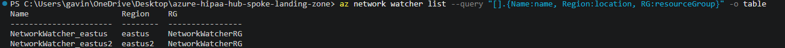

### Step 7 — Deploy

Run each line separately:

```powershell
az login
```
```powershell
terraform init
```
```powershell
terraform plan "-out=main.tfplan"
```
```powershell
terraform apply main.tfplan
```

I apply a saved plan rather than running a bare `terraform apply`, which re-plans and asks for confirmation. The saved plan guarantees that exactly what I reviewed is what gets built; if anything drifts in between, Terraform refuses to apply it as stale. The first plan was `51 to add`. The quotes around `-out=...` matter in PowerShell (see Troubleshooting).

My first apply created everything except the Spoke 1 flow log, which failed with an Azure-side error. After cleaning that up and fixing Defender plan drift (both in Troubleshooting), a fresh plan showed exactly `1 to add`:

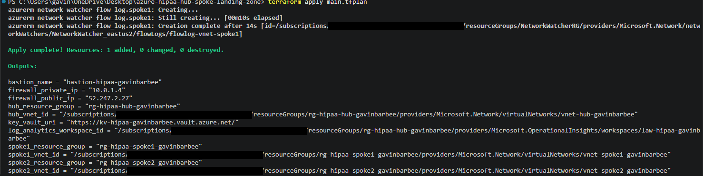

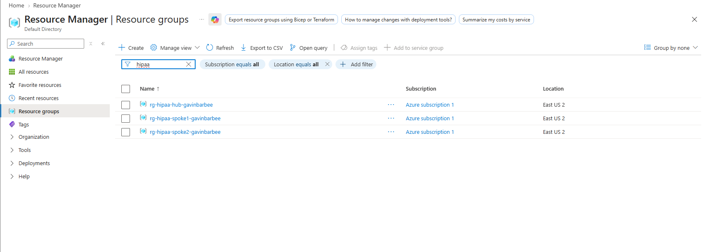

### Step 8 — Validate network isolation

These checks confirm the key security properties without any VMs deployed in the spokes.

**Firewall private IP** (the next hop both route tables should point to):

```powershell
terraform output firewall_private_ip
```

**Spoke 1 route table sends `0.0.0.0/0` to the firewall:**

```powershell
az network route-table show --name rt-spoke1-gavinbarbee --resource-group rg-hipaa-spoke1-gavinbarbee --query "routes[].{Name:name, Prefix:addressPrefix, NextHop:nextHopIpAddress}" --output table
```

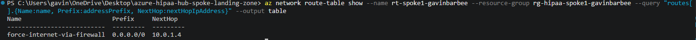

**Both hub peerings are Connected:**

```powershell
az network vnet peering list --resource-group rg-hipaa-hub-gavinbarbee --vnet-name vnet-hub-gavinbarbee --query "[].{Name:name, State:peeringState}" --output table
```

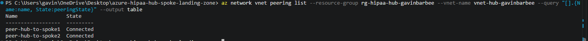

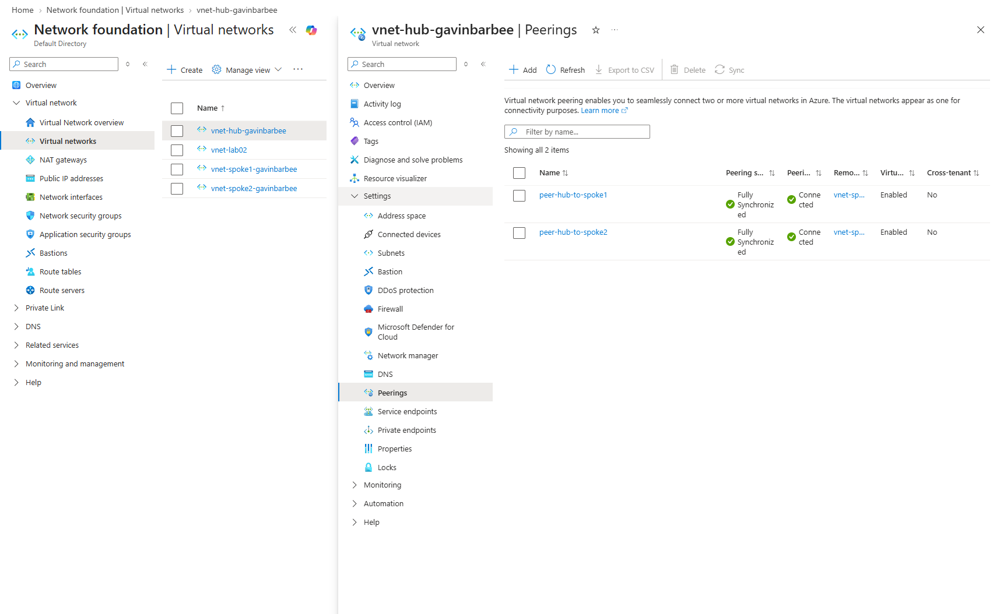

**NSG rules block internet and cross-spoke inbound:**

```powershell
az network nsg show --name nsg-spoke1-app-gavinbarbee --resource-group rg-hipaa-spoke1-gavinbarbee --query "securityRules[].{Name:name, Priority:priority, Access:access, Direction:direction, Source:sourceAddressPrefix}" --output table
```

Expected: `deny-internet-inbound` at priority 4000 and `deny-spoke2-inbound` at priority 3000, both `Deny`.

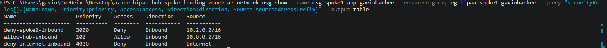

**The firewall policy is actually attached to the firewall:**

```powershell
az network firewall show --name fw-hipaa-gavinbarbee --resource-group rg-hipaa-hub-gavinbarbee --query "firewallPolicy.id" --output tsv
```

Expected: a resource ID ending in `firewallPolicies/fwpol-hipaa-gavinbarbee`. On first use, the Azure CLI prompted me to install the `azure-firewall` extension; answering `Y` installs it and the command continues.

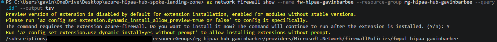

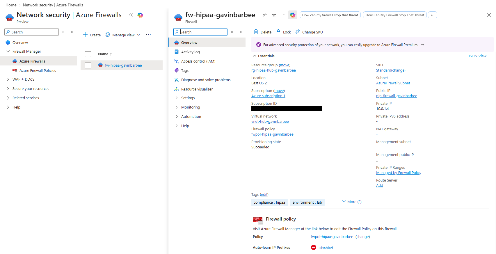

**Key Vault network ACLs default to Deny:**

```powershell
az keyvault show --name kv-hipaa-gavinbarbee --query "properties.networkAcls.defaultAction" --output tsv
```


**VNet flow logs are enabled on all three VNets:**

```powershell
az network watcher flow-log list --location eastus2 --query "[].{Name:name, Enabled:enabled, RetentionDays:retentionPolicy.days}" --output table
```

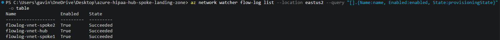

### Step 9 — Query firewall logs in Log Analytics

In the portal: Log Analytics workspace `law-hipaa-gavinbarbee` → **Logs**. `AzureDiagnostics` only creates a column like `msg_s` once the first row containing it arrives, so I use `column_ifexists` to keep the query from failing on a workspace that hasn't received firewall rule logs yet:

```kusto
AzureDiagnostics
| where ResourceType == "AZUREFIREWALLS"
| where TimeGenerated > ago(1h)
| project TimeGenerated, msg_s = column_ifexists("msg_s", ""), Protocol_s = column_ifexists("Protocol_s", ""), SourceIP_s = column_ifexists("SourceIP_s", ""), DestinationIP_s = column_ifexists("DestinationIP_s", ""), Action_s = column_ifexists("Action_s", "")
| order by TimeGenerated desc
| take 50
```

In my run, the legacy rule-log table returned no rows in the query window:

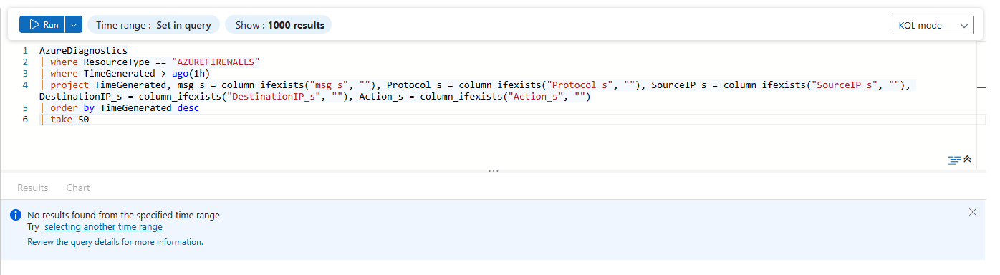

To confirm the firewall → Log Analytics diagnostic pipeline itself was working, I queried the firewall's metrics in the same workspace:

```kusto
AzureMetrics
| where ResourceProvider == "MICROSOFT.NETWORK"
| where TimeGenerated > ago(1h)
| take 20
```

Metrics were arriving every minute, including `FirewallHealth` at 100% and `NetworkRuleHit` counts:

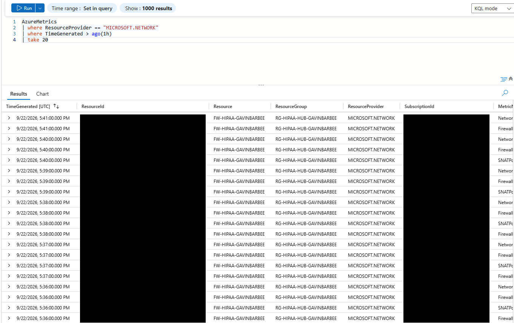

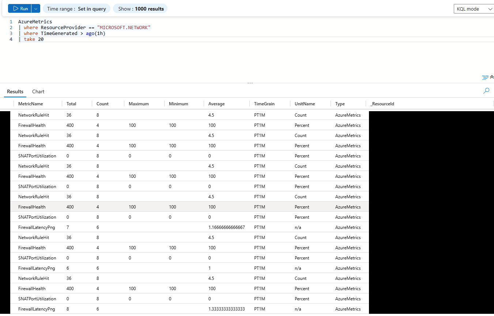

## ✅ Verification Checklist

- [x] Three resource groups visible: `rg-hipaa-hub-gavinbarbee`, `rg-hipaa-spoke1-gavinbarbee`, `rg-hipaa-spoke2-gavinbarbee`
- [x] Hub VNet has four subnets: `AzureFirewallSubnet`, `AzureBastionSubnet`, `GatewaySubnet`, `shared-services-subnet`
- [x] `fw-hipaa-gavinbarbee` provisioned (Succeeded), with `fwpol-hipaa-gavinbarbee` attached
- [x] Hub VNet → Peerings shows both spoke peerings as **Connected**
- [x] Spoke route tables have `0.0.0.0/0` → firewall private IP (`10.0.1.4`)
- [x] All four spoke subnets have an NSG attached
- [x] VNet flow logs enabled on hub, Spoke 1, and Spoke 2 (all `Succeeded`)
- [x] Key Vault network ACL default action is **Deny**
- [x] Firewall metrics arriving in `law-hipaa-gavinbarbee`
- [x] HITRUST/HIPAA initiative assigned and evaluating (see below)
- [x] Defender for Cloud shows Servers, Storage, and Key Vaults **On**

**Policy compliance:** the initiative reported 49 non-compliant resources and 23 non-compliant policies. That count covers the whole subscription, which still held resources from earlier projects (SQL servers, Function Apps, Logic Apps, other storage accounts), and many of the top failures belong to those. The ones that apply to this build are real gaps: `shared-services-subnet` has no NSG, Key Vault and the audit storage account have no resource-level diagnostic settings, and neither uses private or service endpoints. I treat the initiative as a gap list for the next iteration rather than a pass/fail score.

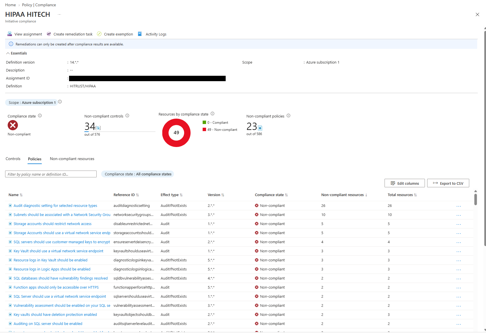

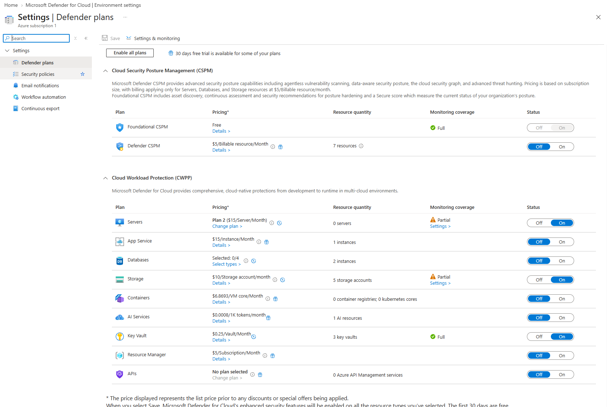

## 🛠️ Troubleshooting

| Issue | Cause | Resolution |
|---|---|---|
| `terraform validate` failed: `target_resource_id` not expected, `network_security_group_id` required on `azurerm_network_watcher_flow_log` | I started on azurerm `~> 3.0`, which resolved to 3.117.1. That version only supports NSG-scoped flow logs, and Azure no longer allows new NSG flow logs to be created. | Upgraded to azurerm `~> 4.0` with `terraform init -upgrade`. That also meant adding `subscription_id` to the provider block (required in 4.x) and replacing the removed `disable_bgp_route_propagation = true` with `bgp_route_propagation_enabled = false` on both route tables. |
| `terraform plan -out=main.tfplan` failed: "Too many command line arguments" | PowerShell splits an unquoted `-out=main.tfplan` at the period, so Terraform received two arguments. | Quoted the argument: `terraform plan "-out=main.tfplan"`. |
| Apply failed on `flowlog-vnet-spoke1`: `InternalServerError` while polling | Azure accepted the create and then its own background operation failed. The hub and Spoke 2 flow logs, created at the same time, succeeded. The failed one was left behind in Azure in a `Failed` provisioning state, outside Terraform state. | Confirmed with `az network watcher flow-log list`, deleted the failed resource with `az network watcher flow-log delete --location eastus2 --name flowlog-vnet-spoke1`, re-planned (`1 to add`), and applied. |
| Re-plan wanted to destroy and recreate all three Defender plans (`subplan` → `null`, forces replacement) | I hadn't set `subplan`, so Azure filled in its defaults (`P2`, `DefenderForStorageV2`, `PerKeyVault`). Terraform then saw a diff it could never resolve, on an attribute that forces replacement. | Pinned `subplan` explicitly to the values Azure already had. The next plan showed only the flow log. Reviewing the saved plan caught this before anything was applied. |
| Firewall log query failed: `Failed to resolve scalar expression named 'msg_s'` | `AzureDiagnostics` columns are created only when the first row containing them arrives, and no firewall rule logs had landed in the workspace yet. | Wrapped each column in `column_ifexists()`, and verified the pipeline with an `AzureMetrics` query instead. |
| `terraform destroy` failed: resource group `rg-hipaa-hub-gavinbarbee` still contains resources | Traffic Analytics on the VNet flow logs auto-created a Data Collection Rule and Data Collection Endpoint (`NWTA-*`) in the workspace's resource group. Terraform doesn't manage them, so the provider's `prevent_deletion_if_contains_resources` check blocked the delete. | Deleted the two `NWTA-*` resources explicitly (rule first, then endpoint) and re-ran `terraform destroy`. I kept the safety check on rather than disabling it; see Cleanup. |

## 🧹 Cleanup

Azure Firewall bills by the hour, so I tear everything down as soon as I'm done. Traffic Analytics creates two resources in the hub resource group that Terraform doesn't manage, so I remove those first. Run each line separately:

```powershell
$dcr = az resource list --resource-group rg-hipaa-hub-gavinbarbee --resource-type Microsoft.Insights/dataCollectionRules --query "[0].id" -o tsv
```
```powershell
az resource delete --ids $dcr
```
```powershell
$dce = az resource list --resource-group rg-hipaa-hub-gavinbarbee --resource-type Microsoft.Insights/dataCollectionEndpoints --query "[0].id" -o tsv
```
```powershell
az resource delete --ids $dce
```
```powershell
terraform destroy
```

I could have set `prevent_deletion_if_contains_resources = false` in the provider instead, but that makes Terraform delete anything in a resource group without checking. In an environment holding ePHI, an unexpected resource is something to look at before it disappears, so I'd rather delete known resources explicitly.

Notes:

- **Key Vault name stays reserved for 90 days.** With purge protection enabled, the vault goes into soft delete and can't be purged early. Redeploying with the same name still works because the provider is configured to recover the soft-deleted vault.
- **`NetworkWatcherRG` remains.** It's Azure-managed, not created by Terraform, and has no running cost.
- **Defender plans are subscription-wide.** After destroy, I confirmed that Servers, Storage, and Key Vault were back to Off:

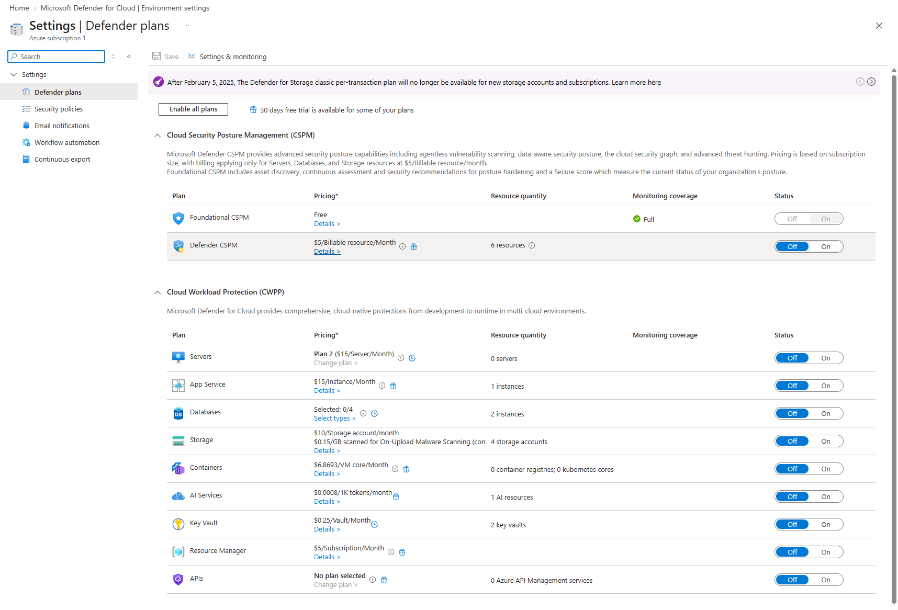

## 💡 Key Takeaways

- **A successful deploy is not a working control.** The firewall policy and its rules can deploy cleanly while never being attached to the firewall. Cross-spoke traffic would still have been dropped by the firewall's implicit default-deny, but not by a named rule I could show an auditor. I verify controls by checking the specific property (`firewallPolicy.id`), not by trusting a clean `apply`.
- **Azure creates things you didn't ask for, and IaC has to account for them.** Three times in one build, the platform acted on its own: it auto-created the regional Network Watcher, filled in Defender subplans that caused a never-ending replace diff, and had Traffic Analytics create collection resources that blocked `terraform destroy`. Each required either referencing the platform's resource, pinning its value explicitly, or cleaning it up deliberately.
- **Reviewing saved plans prevents real damage.** The re-plan after the flow-log failure quietly included destroying and recreating three subscription-wide security plans. Applying a saved, reviewed plan instead of typing "yes" to a fresh one is what caught it.
- **Compliance tooling ages fast.** NSG flow logs can no longer be created, and replacing them with VNet flow logs required a major provider upgrade (azurerm 3.x → 4.x) along with its breaking changes. For regulated workloads, the logging design itself has to be kept current, not just the resources.
- **A policy initiative is most useful as a gap list.** The HITRUST/HIPAA initiative flagged 49 non-compliant resources, many of them leftovers from other projects in the same subscription. That's also an argument for dedicated subscriptions per environment. The failures that did belong to this build define the next iteration: an NSG on `shared-services-subnet`, diagnostic settings on Key Vault and storage, private endpoints, and customer-managed keys.
- **The business value is inheritance.** With the hub in place, any new clinical or analytics workload dropped into a spoke gets inspected egress, segmentation from other data tiers, and a network audit trail from its first day, without its team rebuilding those controls. That shortens delivery for each new workload and gives auditors one consistent place to review, instead of a different security setup per application.

---

**Author:** Gavin Barbee | **Project:** HIPAA-Compliant Hub-and-Spoke Landing Zone | **Difficulty:** Intermediate–Advanced | **Time to Complete:** ~1.5 hours (deploy, validation, and teardown)